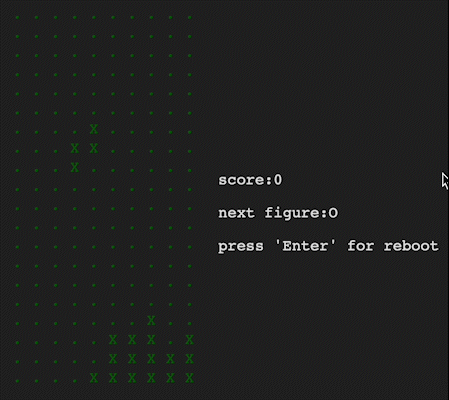

<h1 align="center">Тетрис</h1>

<a href='https://azemcov.github.io/TETRIS'>👉👉 ОТКРЫТЬ 👈👈</a>

## 📖 Описание

Тетрис - это популярная игра, в которой игрок управляет падающими геометрическими фигурами (называемыми тетромино) и располагает их так, чтобы создавать горизонтальные линии без пробелов. Когда горизонтальная линия заполняется, она исчезает, освобождая место для следующих фигур.
 
[статья на wiki](https://ru.wikipedia.org/wiki/Тетрис)
 
В данном репозотории представлена моя простенькая реализация некода культовой игры на react.

## 🔥 Обновления

- **`октябрь 9, 2024`**: Версия 1.0 (Десктопная версия)

## ⚙️ Использованные технологии

<a href="https://developer.mozilla.org/en-US/docs/Web/JavaScript">  </img> </a>
<a href="https://react.dev/"> </img></a>
<a href="https://html.spec.whatwg.org/multipage/"> </img></a>
<a href="https://www.w3.org/Style/CSS/Overview.en.html"> </img></a>

